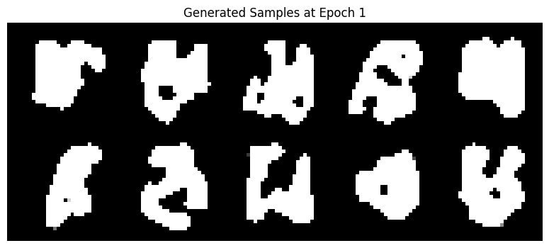
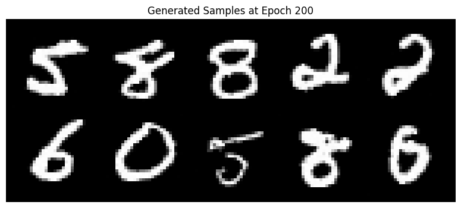
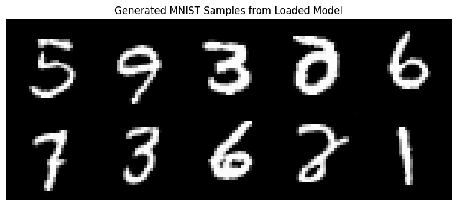
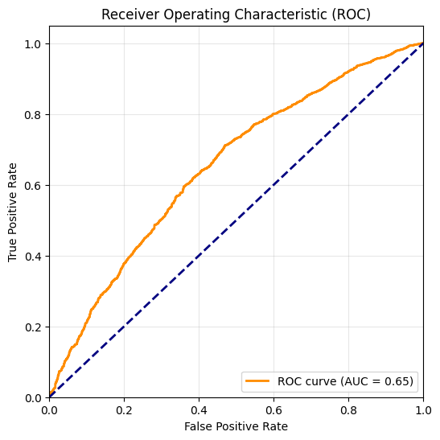

# My-deep-learning-projects
このポートフォリオは、PyTorchを用いた深層学習の実装コードのコレクションです.
CNNによる画像分類から、最新の生成AI (DDPM, GPT)、実務応用のための異常検知まで、幅広いタスクのモデリングとパイプライン構築とを行いました.

## 成果・サマリー

| プロジェクト名 | タスク・ドメイン | 主要技術・モデル | アピールポイント |
| :--- | :--- | :--- | :--- |
| 1. CIFAR-10 画像分類 | 画像 / 多クラス分類 | CNN, PyTorch | ネットワーク構造の設計と学習率スケジューラ |
| 2. 転移学習による画像分類 | 画像 / 転移学習 | ResNet | 事前学習済みモデルの活用|
| 3. DDPMによる画像生成 | 画像 / 生成モデル | Denoising Diffusion Probabilistic Models | 拡散モデルのU-Net構造による実装とノイズスケジューリング |
| 4. 青空文庫 GPT文章生成 | 自然言語 / テキスト生成 | Transformer (Decoder-only) | GPT形式のモデルの実装とハイパーパラメータの調整 |
| 5. Autoencoder 異常検知 | 画像 / 異常検知 | Convolutional Autoencoder | 再構成誤差を用いたデータ解析 |

---

## 各プロジェクトの詳細

### 1. CIFAR-10 画像分類 (Scratch CNN)
*   **課題・目的**: $10$ 種類のオブジェクト画像を自動分類すること. 深層学習の基本である畳み込みニューラルネットワーク (CNN) の挙動を理解すること.
*   **技術的アピール（工夫した点）**:
    *   CNNのスクラッチモデルを実装しました.
    *   `torchvision.transforms` を用いたデータ拡張 (RandomCrop, RandomHorizontalFlip) により汎化性能を向上させました.
    *   学習率を動的に変更する `lr_scheduler` (CosineAnnealingLR) を導入し、短エポック ( $50$ エポック) による学習での高精度化を達成しました.
    *   CIFAR-10のタスクにおいて、正解率は $84.01\%$ に達しました. 事前学習モデル (転移学習) を使わず、データ拡張とスケジューラを導入しただけのシンプルなCNNモデルであるため、ベストに近い結果であると考えられます.

### 2. 転移学習による画像分類
*   **課題・目的**: 1.のスクラッチモデルを超える精度を達成し、限られた計算資源での効率的な学習を行うこと.
*   **技術的アピール（工夫した点）**:
    *   事前学習されたモデル (ResNet18) をインポートし、すべての層をファインチューニングしました.
    *   CIFAR-10に最適化するために最初のConv層を変更 (デフォルトの $7\times 7$ カーネル, ストライド $2$ から $3\times 3$ カーネル, ストライド $1$ へ変更) しMaxPoolを削除しました.
    *   AutoAugmentによりデータ拡張を強化しました.
    *   1.と同じく、学習率を動的に変更する `lr_scheduler` (CosineAnnealingLR) を導入しました.
    *   CIFAR-10のタスクにおいて、正解率は $92.62\%$ に達しました. モデルの構造だけでなく、データ拡張 (AutoAugment) と学習時間 (GPU: T4において約 $50$ 分間) とのバランスが正しく機能した結果であると考えられます.

### 3. DDPM (Denoising Diffusion Probabilistic Models) による画像生成
*   **課題・目的**: 拡散モデル (Diffusion Model) の仕組みを理解し、MNISTデータセットに似た数字画像をゼロから生成すること.
*   **技術的アピール（工夫した点）**:
    *   順方向のノイズ付加 (Forward Process) と、逆方向のノイズ予測 (Reverse Process) の数式を正しくPyTorchコードに落とし込みました. その際にコサインによるノイズスケジューリングを行いました.
    *   U-Net構造を採用し、タイムステップ (Time Embedding) を条件付けとしてモデルに入力する機構を作成しました.
    *   訓練によって、よりクリアな数字画像が生成されるプロセスを以下に、 $1$, $200$, $400$ エポックにおける生成画像 (各 $10$ 枚) によって示します.

| 初期段階 ($1$ エポック) | 訓練の途中経過 ($200$ エポック) | 最終生成画像 ($400$ エポック) |
| :---: | :---: | :---: |
|  |  |  |

### 4. 青空文庫によるミニGPT文章生成
*   **課題・目的**: 大規模言語モデル (LLM) の基盤であるTransformer構造を理解し、日本語の文脈に沿ったテキストを自動生成すること.
*   **技術的アピール（工夫した点）**:
    *   GPT-2の派生モデルのファインチューニングを行うのではなく、PyTorchの基本機能 (単語埋め込み, 位置エンコーディング, nn.TransformerDecoder) を使ってゼロからデコーダのみのGPT形式のモデルを実装し、青空文庫にある日本語の夏目漱石のテキストだけを用いて学習させました.
    *   生成をコントロールするために、ハイパーパラメータ (Temperature, Top-k) の調整を行いました.
    *   最終的な損失値は $4.1439$ に達しました. これは、膨大な日本語の単語候補の中から、モデルが次の単語を平均 $e^{4.1439}\approx 63$ 個の候補にまで絞り込めている、という状態を指しています.
    *   以下は漱石の『こころ』における文脈を想定し、「先生は私に」から始まる文章を訓練終了後に生成したサンプルです.
    ```text
    先生 は 私 に 向かっ に たかっ た 。 私 は は 「 信用 を 信用 し 」 先生 から 私 何 に 驚か た の も て い に い なかっ た 。
    ```
    *   この出力は『こころ』の核心的なテーマである (先生から私への) 「信用」と「告白」を生成していると解釈できます.

### 5. Autoencoderによる異常検知とデータ解析
*   **課題・目的**: CIFAR-10の特定クラス (「飛行機」) のみを「正常」として学習させ、それ以外のクラスを「異常」として検知すること.
*   **技術的アピール（工夫した点）**:
    *   Convolutional Autoencoder (畳み込み自己符号化器) を実装しました. 正常データのみの再構成誤差 (MSE) を最小化するように学習させました.
    *   **データ解析1**: テストデータにおける再構成誤差のワースト $4$ 位までの画像を抽出し、オリジナル画像、再構成画像、および両者のずれを示す画像の $3$ 種類を提示することで、モデルが捉えきれなかった特徴の傾向を視覚的に分析しました.
    *   **データ解析2**: 異常検知の最適な閾値 (Threshold) を、正常データのみの再構成誤差の平均値 ($\mu$) と再構成誤差の標準偏差 ($\sigma$) とから、 $\mu+3\sigma$ ($3$ シグマ則: 再構成誤差が正規分布に従うと仮定した場合に、理論上 $99.7\%$ の正常品が収まる範囲) として決定し、任意のテストデータに対して正常/異常の判定をくだすデータ解析プロセスを構築しました.
    *   **データ解析3**: 閾値全体にわたるモデルの識別性能を測るために、テストデータ全体を対象に、ROC曲線 (Receiver Operating Characteristic Curve) と、その積分値であるAUC (Area Under the Curve: $0.5$ 以上、 $1$ 以下の値を取り、値が $1$ に近い程、識別性能が良い) とを算出しました.
    *   **データ解析4**: 以下はテストデータに対するモデルの識別性能を表す **ROC曲線** です. 算出されたAUCの値は $0.65$ ですが、これはCIFAR-10のタスクが低解像度 ($32 \times 32$ ピクセル) であり、かつ、背景を含めて「飛行機」の画像と類似した視覚的特徴を持つ他クラスとを再構成誤差 (MSE) だけで識別することの本質的な限界を示していると考えられます.


---

## 共通で使用している技術・環境
*   **Framework**: PyTorch (2.11.0)
*   **Libraries**: Torchvision, NumPy, Matplotlib, Scikit-learn
*   **Environment**: Google Colab (GPU: T4)

---

## ディレクトリ構成
```text
├── projects/
│   ├── 01_cifar10_cnn_classifier.ipynb
│   ├── 02_cifar10_resnet_classifier.ipynb
│   ├── 03_mnist_ddpm_model.ipynb
│   ├── 04_soseki_gpt_transformer.ipynb
│   └── 05_cifar10_autoencoder_anomaly_detection.ipynb
├── images/
│   ├── epoch_1.png
│   ├── epoch_200.png
│   ├── sample_epoch_400.png
│   └── roc_curve.png
├── requirements.txt
└── README.md
```

---

## 実行方法
1.  **プロジェクトの選択と実行**: 任意のプロジェクト (例：異常検知) のセクションにある「Open in Colab」バッジをクリックし、Google Colab上でノートブックを開きます.
2.  **依存ライブラリのインストール**: 各ノートブックの最初のセルを実行し、必要な依存ライブラリをインストールしてからコードを上から順に実行してください.
